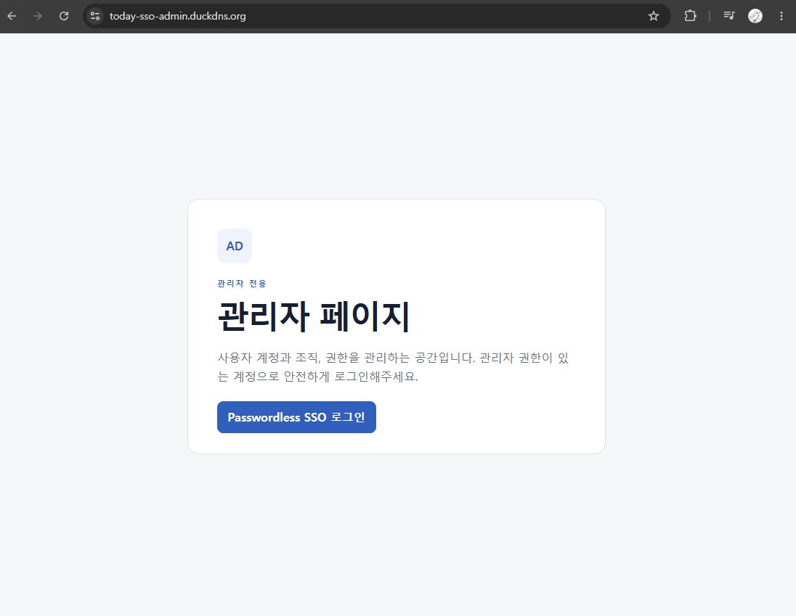
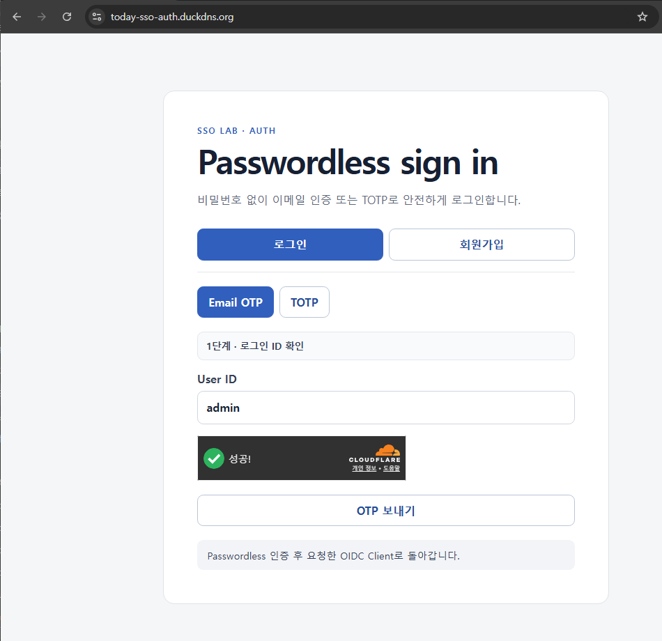
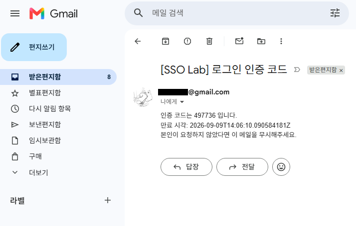
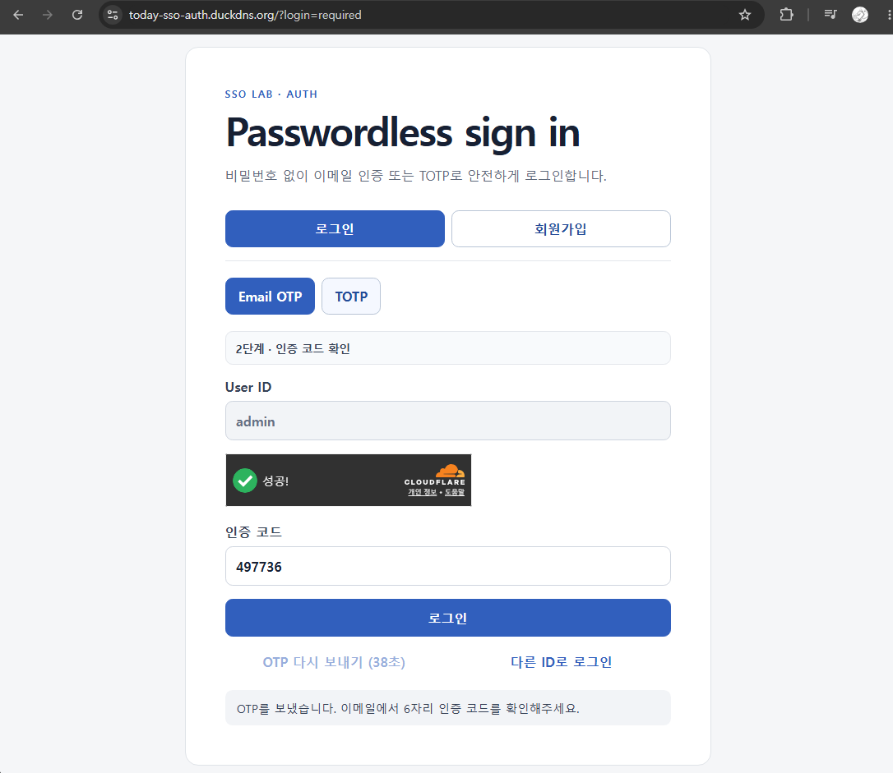
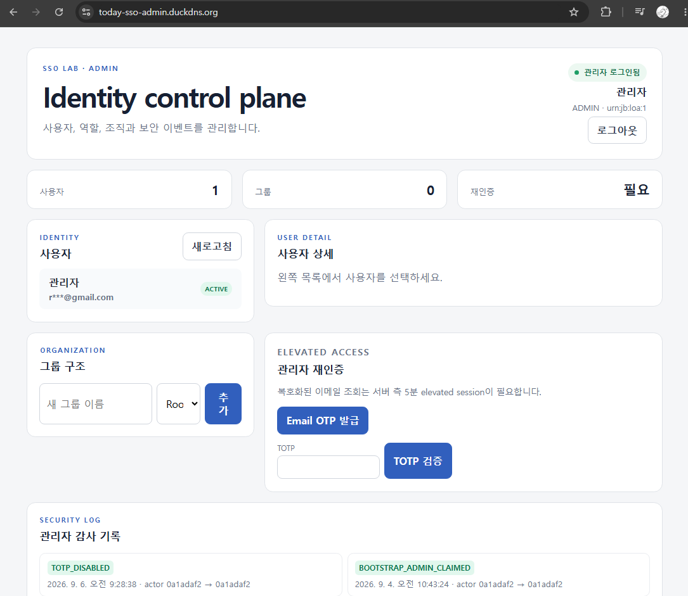
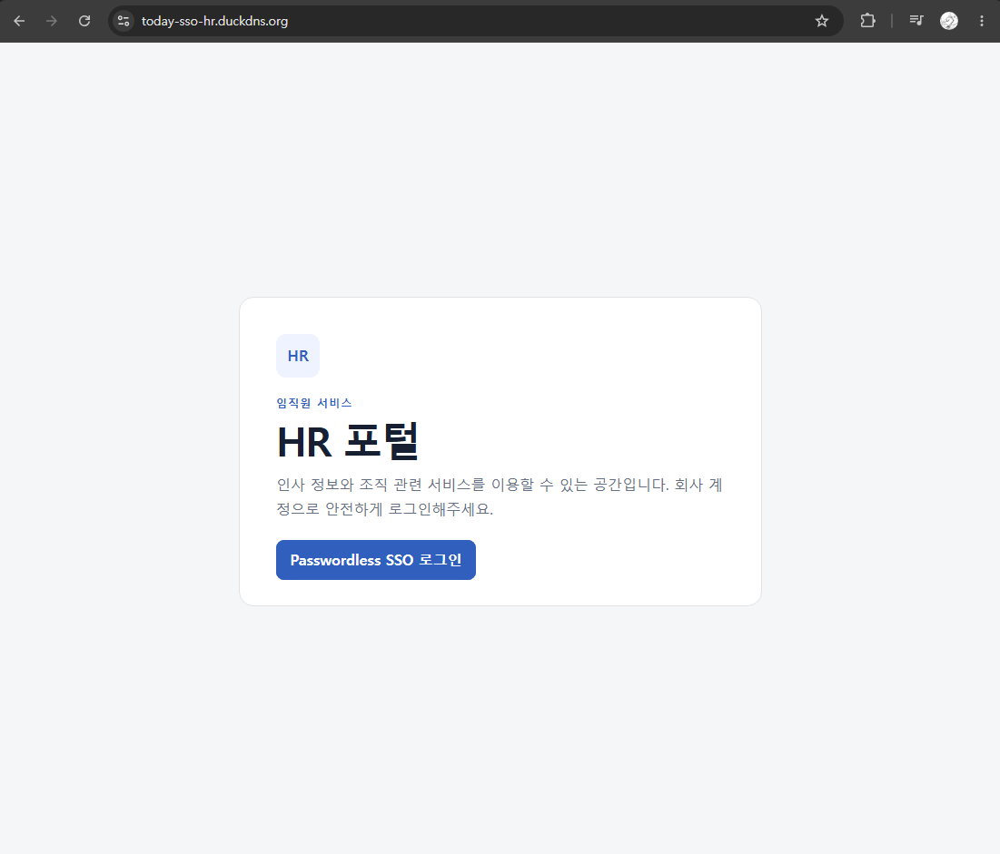
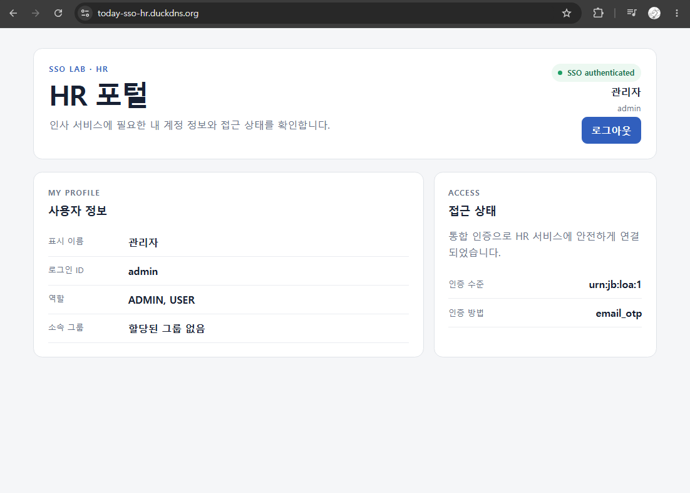
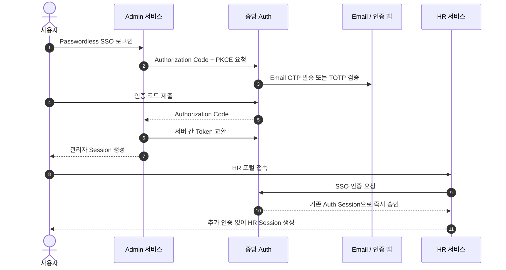
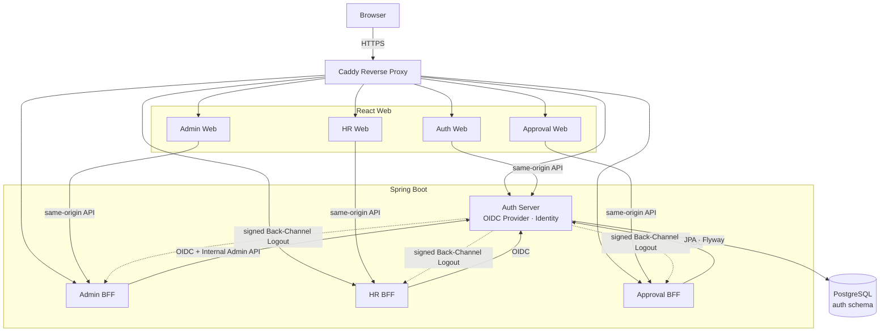

# SSO Lab

> 한 번의 Passwordless 인증으로 관리자, HR, 전자결재 서비스를 이용하는 사내 통합인증 플랫폼

[](https://github.com/relate16/sso-lab/actions/workflows/ci.yml)

SSO Lab은 중앙 Auth Server와 서비스별 BFF를 직접 구현해, 비밀번호 없이 로그인하고 여러 업무 서비스에 다시 인증하지 않고 접근하는 과정을 보여주는 프로젝트입니다. 단순 로그인 화면에 그치지 않고 사용자·권한 관리, 세션 폐기, 중앙 로그아웃, 보안 통제와 배포 자동화까지 하나의 흐름으로 구성했습니다.

**Live:** [Admin](https://today-sso-admin.duckdns.org) · [HR](https://today-sso-hr.duckdns.org) · [Approval](https://today-sso-approval.duckdns.org) · [Auth](https://today-sso-auth.duckdns.org)

> 개인 시연 서버이므로 점검 중에는 접속이 일시적으로 제한될 수 있습니다. 계정 정보는 공개하지 않으며, 아래 화면만으로도 핵심 인증 흐름을 확인할 수 있습니다.

## SSO Demo — Screenshot / GIF로 보는 Passwordless 인증

아래 예시는 **관리자 페이지에서 로그인을 시작해 Email OTP 인증을 완료한 뒤, HR 포털에도 추가 인증 없이 접속하는 과정**입니다. Approval도 같은 중앙 인증과 SSO 구조를 사용합니다.

### 1. 관리자 페이지에서 통합 로그인을 시작합니다

<table>
  <tr>
    <td width="50%" align="center"><strong>관리자 페이지 — 로그인 전</strong></td>
    <td width="50%" align="center"><strong>중앙 Auth — Passwordless 인증</strong></td>
  </tr>
  <tr>
    <td></td>
    <td></td>
  </tr>
  <tr>
    <td>관리자 페이지는 인증되지 않은 사용자에게 SSO 로그인만 안내합니다.</td>
    <td>로그인 요청은 중앙 Auth로 이동하며 Email OTP 또는 TOTP를 선택할 수 있습니다.</td>
  </tr>
</table>

### 2. 이메일로 받은 일회용 인증 코드를 확인합니다

<table>
  <tr>
    <td width="50%" align="center"><strong>Email OTP 수신</strong></td>
    <td width="50%" align="center"><strong>6자리 인증 코드 입력</strong></td>
  </tr>
  <tr>
    <td></td>
    <td></td>
  </tr>
  <tr>
    <td>사용자의 암호 대신 짧게 만료되는 일회용 인증 코드를 발송합니다.</td>
    <td>재발송 제한과 최대 시도 횟수를 서버에서 검증한 뒤 Auth SSO Session을 생성합니다.</td>
  </tr>
</table>

### 3. 인증이 완료되면 관리자 기능을 사용할 수 있습니다

<p align="center">
  
</p>

관리자 권한은 Browser가 전달한 값이 아니라 검증된 OIDC Claim을 기준으로 판정합니다. 관리자는 사용자 상태와 Role, 계층형 Group을 관리하고, 민감한 작업에는 별도의 Email OTP/TOTP 재인증을 거칩니다. 주요 작업은 Audit으로 남습니다.

### 4. 다른 서비스는 다시 인증하지 않고 이용합니다

<table>
  <tr>
    <td width="50%" align="center"><strong>HR 포털 — 접속 전</strong></td>
    <td width="50%" align="center"><strong>기존 SSO Session으로 접속 완료</strong></td>
  </tr>
  <tr>
    <td></td>
    <td></td>
  </tr>
  <tr>
    <td>HR은 독립된 Client/BFF Session을 사용하며 중앙 Auth에 인증을 요청합니다.</td>
    <td>이미 Auth에서 인증했으므로 OTP를 다시 입력하지 않고 HR callback과 로그인이 완료됩니다.</td>
  </tr>
</table>

## 핵심 기능

| 기능 | 사용자에게 제공하는 경험 |
|---|---|
| Passwordless 로그인 | 비밀번호 대신 Email OTP 또는 인증 앱의 TOTP로 로그인합니다. |
| 통합 로그인(SSO) | Admin에서 인증한 뒤 HR·Approval에 접속하면 추가 로그인 없이 연결됩니다. |
| 계정 보안 | Recovery Code, 이메일 변경 인증, 사용자 정지와 중요 작업 재인증을 제공합니다. |
| 관리자 기능 | 사용자, Role, 계층형 Group과 계정 상태를 중앙에서 관리합니다. |
| 내 세션 관리 | 로그인된 기기를 확인하고 본인이 선택한 세션을 종료할 수 있습니다. |
| 통합 로그아웃 | Auth Session뿐 아니라 연결된 BFF Session과 OAuth Token까지 함께 폐기합니다. |
| 감사 추적 | 관리자 작업, 사용자 정보 변경, TOTP 해제 등 중요 이벤트를 추적합니다. |

HR과 Approval은 SSO를 사용하는 업무 Client의 예시입니다. 이 프로젝트의 핵심은 업무 데이터 자체가 아니라 **서비스가 분리되어 있어도 중앙 인증과 보안 경계를 일관되게 유지하는 구조**에 있습니다.

## 사용자 관점의 SSO 흐름



Email OTP와 TOTP는 선택 가능한 Passwordless 인증 방식입니다. 둘을 동시에 요구하는 strict MFA는 아니며, Recovery Code는 일반 로그인 수단이 아니라 TOTP 복구에만 사용합니다.

## 기술 아키텍처



- 외부 요청은 Caddy의 HTTPS endpoint로만 진입합니다.
- Admin/HR/Approval은 Authorization Code + PKCE S256를 사용하는 confidential BFF입니다.
- Access/Refresh Token은 Browser Storage가 아니라 각 BFF의 서버 Session에 보관합니다.
- Identity 데이터와 `auth` schema에는 Auth Server만 직접 접근합니다. 다른 서비스는 OIDC Claim, UserInfo 또는 Internal API 경계를 사용합니다.
- `/internal/**`, Backend `8080`, PostgreSQL `5432`, Caddy Admin API는 외부에 공개하지 않습니다.

상세한 서비스 경계와 향후 schema ownership 정책은 [Architecture](docs/ARCHITECTURE.md)를 참고하세요.

## 구현 범위

### Auth / 사용자

- Signup Email OTP와 Login Email OTP
- TOTP 등록·로그인·해제와 Recovery Code 재발급/사용
- Profile 조회, username 변경, 새 Email OTP 기반 email 변경
- 사용자 본인의 세션 목록 조회와 개별 종료
- fresh re-authentication 기반 Hard Delete
- SUSPENDED 사용자 인증 및 기존 Session 차단

### OIDC / SSO / Logout

- Spring Authorization Server 기반 OIDC Provider
- Authorization Code Flow + PKCE S256
- ID Token, Access Token, Refresh Token rotation, UserInfo와 Role/Group Claim
- exact redirect URI와 exact post-logout redirect URI
- RP-Initiated Logout, 서명된 Back-Channel Logout, Global Logout
- Global Logout 시 Auth/BFF Session과 OAuth authorization/token 동시 폐기

### Admin

- 서버에서 검증된 `ADMIN` Role 기반 접근 제어
- 사용자 조회, Suspend/Resume, Role과 계층형 Group 관리
- Email OTP/TOTP 기반 관리자 fresh re-authentication
- Bootstrap Admin one-shot claim과 마지막 ACTIVE ADMIN 보호
- actor/target/source/trace를 포함한 Admin·Security Audit

## Security Highlights

| 영역 | 적용 내용 |
|---|---|
| 개인정보 | Email AES-256-GCM 암호화, 별도 HMAC-SHA256 lookup key |
| 인증정보 | OTP HMAC, TOTP AES-256-GCM, Recovery Code Argon2id hash |
| OAuth/OIDC | 비대칭 RSA 서명, PKCE S256, Refresh Token rotation, exact URI 검증 |
| Browser | Secure/HttpOnly/SameSite=Lax host-only cookie, CSRF 유지, Token Storage 금지 |
| Abuse 방어 | OTP 재발송·시도 제한, Rate Limit, Cloudflare Turnstile, Enumeration 완화 |
| 운영 Secret | SecretProvider와 Docker Secret, 목적별 key 분리, log redaction |
| 네트워크 | Caddy trusted proxy, 외부 공개 port 최소화, Identity DB 직접 접근 제한 |

위협 모델과 상세 정책은 [Security](docs/SECURITY.md)를 참고하세요.

## 기술 스택

| 영역 | 기술 |
|---|---|
| Backend | Java 21, Spring Boot 4.1, Spring Security, Spring Authorization Server, Spring Session |
| Frontend | React 19, TypeScript, Vite 8 |
| Data | PostgreSQL 17, Flyway, JPA |
| Infra | Docker Compose, Caddy, DuckDNS, GHCR |
| Test | JUnit, PostgreSQL Testcontainers, Node Test Runner, Playwright Chromium |
| CI/CD | GitHub Actions, immutable image publish, protected Production deployment |

## 테스트와 배포 품질

GitHub Actions는 Pull Request와 `main` push에서 다음을 자동 검증합니다.

- 네 Backend 전체 Gradle build와 PostgreSQL Testcontainers
- 네 Frontend의 unit test, lint, production build
- OpenAPI/필수 문서 계약
- Secret·PII·Browser Storage·서비스 경계 Audit
- Production Compose rendering, Docker image build, Secret mount와 health

Release workflow는 기존 tag를 덮어쓰지 않는 immutable GHCR image 8개를 생성합니다. Production 배포는 별도의 수동 workflow와 GitHub `production` Environment 승인을 통과해야 하며, 기존 서버의 `.env`와 Docker Secret을 GitHub로 복사하지 않습니다.

- [Test Guide](docs/TEST_GUIDE.md)
- [Deployment](docs/DEPLOYMENT.md)
- [Phase 9 Traceability](md/PHASE9_TEST_DOCS_TRACEABILITY.md)

## 실행하기

### Frontend 일괄 실행

Repository root에서 전역 npm package 없이 네 Vite 개발 서버를 함께 실행할 수 있습니다.

```powershell
npm ci
npm run dev:all
```

| 서비스 | Local Frontend |
|---|---|
| Auth | `http://127.0.0.1:5173` |
| Admin | `http://127.0.0.1:5174` |
| HR | `http://127.0.0.1:5175` |
| Approval | `http://127.0.0.1:5176` |

```powershell
npm run test:all
npm run lint:all
npm run build:all
```

Backend와 Secret 준비, 격리된 local DB, SSH tunnel을 이용한 선택적 shared DB mode는 [Local Setup](docs/LOCAL_SETUP.md)을 따릅니다. 개발 proxy는 same-origin 요청과 CSRF를 유지하고 `/internal/**`를 차단하며, Vite와 Backend 모두 기본적으로 `127.0.0.1`에만 bind됩니다.

## Repository 구조

```text
backend/                 Auth/Admin/HR/Approval 및 shared infrastructure
frontend/                네 React Web과 공통 Vite 개발 설정
docs/images/demo/        README용 SSO 화면 흐름
docs/openapi/            public/internal OpenAPI 3.1 계약
e2e/                     Playwright Browser E2E
infra/                   Docker/Caddy/test configuration
scripts/                 local 실행과 보안·인프라 검증 자동화
docs/                    아키텍처·운영·보안·개발 가이드
md/                      Master Specification 및 Phase 기록
docker-compose*.yml      local, production, isolated E2E 구성
```

## Future Work — 설계상 제한과 향후 과제

- v1은 Email OTP 또는 TOTP 중 하나를 사용하는 Passwordless multi-method 인증이며 strict MFA는 아닙니다.
- Rate Limit과 일부 Session 상태는 단일 Auth Server instance 전제입니다.
- Back-Channel Logout 전송은 bounded best-effort이며 durable outbox/retry는 후속 범위입니다.
- 향후 strict MFA/step-up authentication, 다중 instance, managed Secret/DB, key rotation 자동화와 observability를 확장할 수 있습니다.
