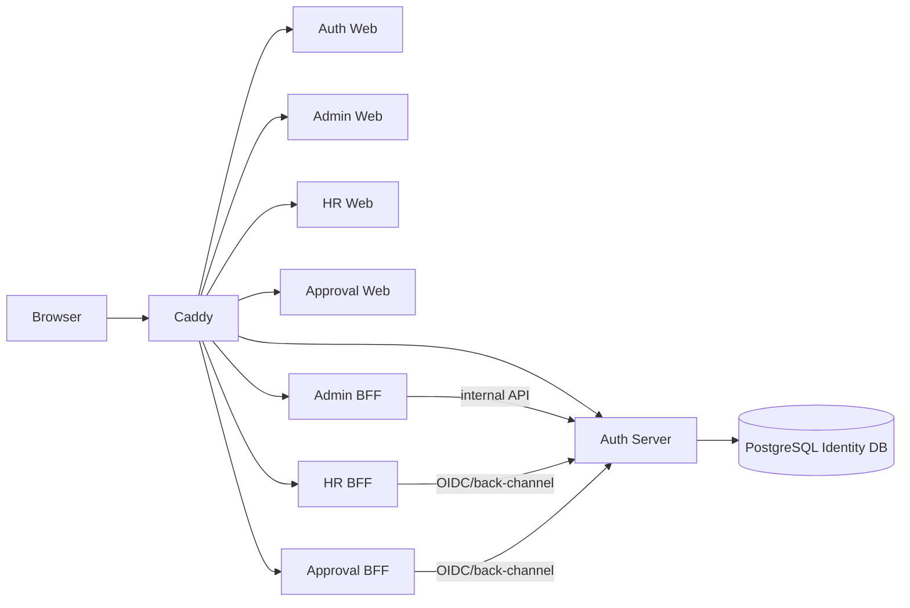

# SSO Lab

Spring Boot Authorization Server와 React BFF 클라이언트로 구현한 Passwordless OIDC SSO 실습 플랫폼입니다.

## 핵심 기술

- Java 21, Spring Boot 4.1.0, Spring Authorization Server, Spring Security/Session
- Gradle 8.14.3, PostgreSQL 17, Flyway
- React 19.2, TypeScript, Vite 8, Node.js 24 LTS
- Docker Compose, Caddy, GitHub Actions, GHCR
- Playwright 기반 격리 Browser E2E

## Architecture



Identity DB에는 `auth-server`만 직접 접근합니다. HR, Approval, Admin은 Authorization Code + PKCE S256를 사용하는 confidential BFF이며 OAuth token을 브라우저 저장소에 두지 않습니다. 상세 설계는 [Architecture](docs/ARCHITECTURE.md)를 참고하세요.

## SSO Demo

1. HR에서 로그인을 시작하면 Auth로 이동합니다.
2. Email OTP 또는 등록된 TOTP로 Passwordless 인증합니다.
3. Auth SSO Session이 생성되고 HR BFF가 서버 측에 token을 보관합니다.
4. 같은 브라우저에서 Approval에 접근하면 재인증 없이 기존 Auth Session으로 SSO가 완료됩니다.
5. Global Logout은 Auth Session, 모든 BFF Session 및 OAuth authorization/token을 폐기합니다.

Email OTP는 이메일 소유 증명을 매번 수행하는 방식이고 TOTP는 사전에 등록한 authenticator와 시간을 기반으로 검증합니다. v1은 두 방식 중 하나를 선택하는 passwordless multi-method 인증이며, 두 요소를 동시에 강제하는 strict MFA는 아닙니다. Recovery Code는 일반 로그인 수단이 아니라 TOTP 복구 전용입니다.

## 사용자와 관리자 기능

- 가입/로그인 Email OTP, TOTP 등록·로그인·복구, Recovery Code
- Profile 조회, username 변경 Audit, 새 Email OTP 기반 email 변경
- 본인 Session 조회/종료, RP/Back-Channel/Global Logout
- fresh re-authentication 기반 Hard Delete 및 관련 credential/session/token 삭제
- Admin User/Role/계층형 Group 관리, Suspend/Resume, email re-auth reveal, Audit
- Bootstrap Admin one-shot claim과 마지막 ACTIVE ADMIN 보호

## Security Highlights

- Email AES-256-GCM 암호화와 별도 HMAC-SHA256 lookup key
- TOTP AES-256-GCM, OTP HMAC, Recovery Code Argon2id hash
- 비대칭 OIDC 서명, 짧은 Access Token TTL, Refresh Token rotation
- exact redirect/post-logout URI, CSRF, Secure/HttpOnly/SameSite=Lax host-only cookie
- Rate limit, Turnstile, enumeration 완화, log redaction
- Docker Secret/SecretProvider, 목적별 key 분리, Caddy trusted-proxy 경계
- Internal API와 PostgreSQL은 외부에 publish하지 않음

위협 모델과 제한은 [Security](docs/SECURITY.md)를 참고하세요.

## 실행과 테스트

- 처음 실행: [Local Setup](docs/LOCAL_SETUP.md)
- 짧은 체크리스트: [DEVELOPER_SETUP.txt](DEVELOPER_SETUP.txt)
- 전체 테스트: [Test Guide](docs/TEST_GUIDE.md)
- VM 배포: [VM Setup Guide](docs/VM_SETUP_GUIDE.md)
- 운영 절차: [Deployment](docs/DEPLOYMENT.md)

로컬 기본 URL은 Auth `http://localhost:8080`, HR `http://localhost:8081`, Approval `http://localhost:8082`, Admin `http://localhost:8083`입니다. 운영 URL은 `.env`의 네 HTTPS hostname으로만 결정하며 공인 IP를 코드에 고정하지 않습니다.

```powershell
.\gradlew.bat clean test
```

각 `frontend/*-web`에서 `npm ci`, `npm test`, `npm run lint`, `npm run build`를 실행합니다. PostgreSQL Testcontainers와 Browser E2E에는 Docker가 필요합니다.

## Repository 구조

```text
backend/                 Auth/Admin/HR/Approval 및 shared infrastructure
frontend/                네 React Web
docs/openapi/            public/internal OpenAPI 3.1 문서
e2e/                     Playwright Browser E2E
infra/                   Docker/Caddy/test configuration
scripts/test/            OpenAPI, E2E, infrastructure 검증 스크립트
docs/                    운영·보안·개발자 가이드
md/                      Master Specification 및 Phase 기록
docker-compose*.yml      local, production, isolated E2E 구성
```

## Screenshot / GIF

> TODO: HR 최초 로그인 → Approval SSO → Global Logout 데모 GIF와 Admin 화면 screenshot을 추가합니다. 실제 email, token, session identifier는 촬영 전에 마스킹해야 합니다.

## Future Work

- strict MFA/step-up authentication과 Approval의 상향된 assurance level
- Redis 기반 분산 rate limit/session, multi-instance Auth Server
- AWS SSM/KMS adapter, managed PostgreSQL/RDS, Kubernetes
- signing/encryption key rotation 자동화와 observability stack

현재 v1의 범위와 완료 근거는 [Phase 9 Traceability](md/PHASE9_TEST_DOCS_TRACEABILITY.md)에 기록합니다.
