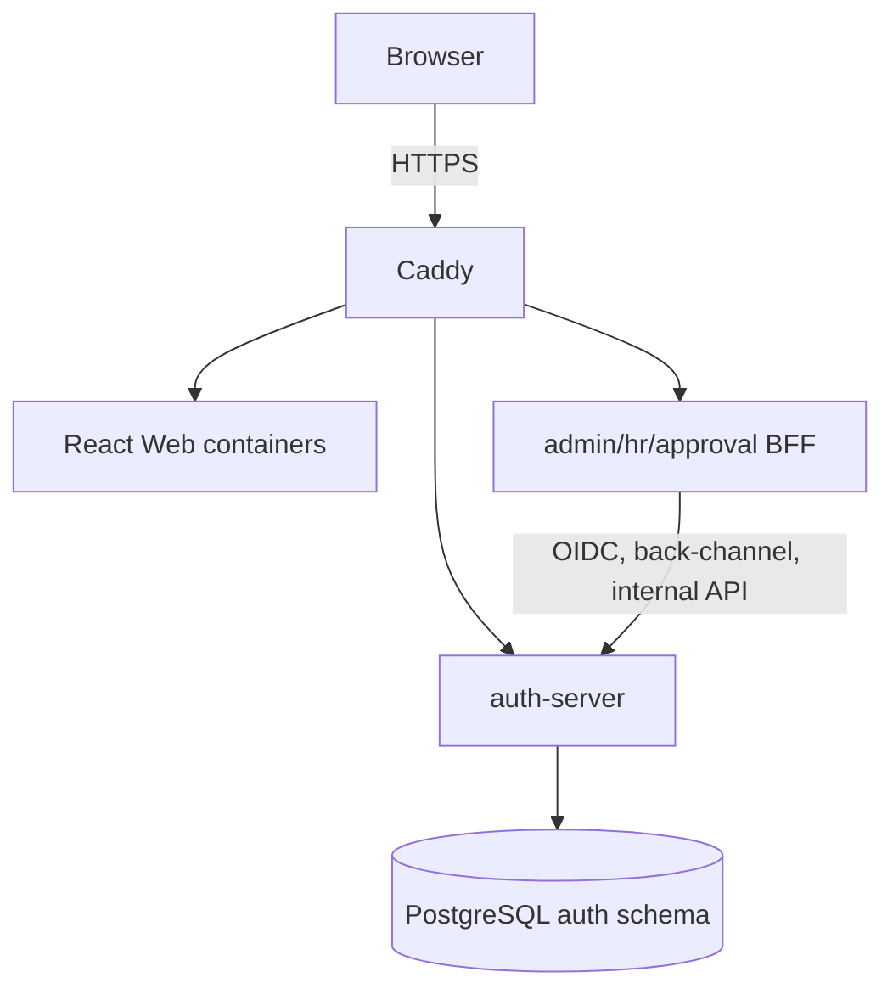

# Architecture

## 서비스와 신뢰 경계

`auth-server`는 User, Role, Group, credential, Spring Session, OAuth authorization와 Audit의 단일 owner입니다. `admin-server`, `hr-server`, `approval-server`에는 JPA/JDBC/PostgreSQL repository를 두지 않습니다. Admin 작업도 `Admin Web → Admin Server → Auth Internal API → Identity Service/Repository` 경계를 지킵니다. Caddy는 `/internal/**`를 외부에서 거부합니다.

## OIDC와 BFF

세 client는 confidential client로 Authorization Code + PKCE S256를 사용합니다. Redirect URI와 post-logout redirect URI는 exact allow-list입니다. Auth는 ID/Access/Refresh Token을 발급하고 BFF는 token을 서버 측 Session에만 저장합니다. Browser에는 HttpOnly/Secure/SameSite cookie만 전달되며 `localStorage`, `sessionStorage`, IndexedDB에 token을 저장하지 않습니다.

BFF를 선택한 이유는 client secret과 refresh token을 브라우저에서 분리하고 CSRF/cookie/session 정책을 서버에서 통제하기 위해서입니다. 대가로 BFF Session 저장소, back-channel logout, CSRF token endpoint와 서비스별 운영이 필요합니다.

## SSO와 identity claim

Auth Passwordless Session을 Spring Authorization Server 인증으로 연결합니다. `sub`는 불변 user UUID이고 `preferred_username`, masked/unmasked email scope, role, group claim은 발급 시점의 Identity를 사용합니다. username/email 변경 뒤 기존 JWT를 수정하지 않으며 새 OIDC 발급부터 새 claim을 반영합니다. Email 변경은 현재 Auth Session만 유지하고 다른 Auth/BFF Session과 모든 Refresh Token을 폐기합니다.

## Logout

- RP-Initiated Logout: client가 Auth end-session endpoint로 이동하고 exact post-logout URI만 허용합니다.
- Back-Channel Logout: Auth가 서명된 logout token을 각 BFF 내부 endpoint로 보내 해당 `sid` Session을 제거합니다.
- Global Logout: Auth Session, OAuth authorization/token과 모든 BFF Session을 함께 폐기합니다.

## 서비스 분리 결정

User Service나 OTP Service를 별도 배포 단위로 쪼개지 않았습니다. 현재 규모에서는 하나의 Identity owner 안의 모듈 경계가 transaction, 암호화, Audit, 삭제 무결성을 더 단순하고 안전하게 유지합니다. Admin Server는 별도 공격 표면과 ADMIN authorization/BFF 책임 때문에 분리하지만 DB ownership은 갖지 않습니다.

React는 네 사용자 경험을 독립적으로 보여주고 SPA 상태/UI 테스트가 쉽다는 장점이 있습니다. 반면 네 bundle과 공통 UI 중복, BFF/CSRF 연동 비용이 있습니다. 인증 정책은 React가 아니라 Backend가 최종 판단합니다.

## 데이터와 인프라

PostgreSQL 하나의 `auth` schema를 사용하되 직접 접근자는 Auth뿐입니다. Flyway V1-V7이 schema를 소유하며 Hibernate는 `validate`만 사용합니다. `db-network`와 `internal-network`는 Docker internal network이고 Host에는 Caddy 80/443만 publish합니다.

Redis는 v1에서 사용하지 않습니다. 단일 Auth 인스턴스 전제에서 Spring Session JDBC와 DB/in-memory rate limit을 사용하며, 다중 인스턴스·분산 제한은 Future Work입니다. AWS SSM/KMS와 RDS도 같은 코드/이미지를 유지하는 향후 인프라 확장입니다.
