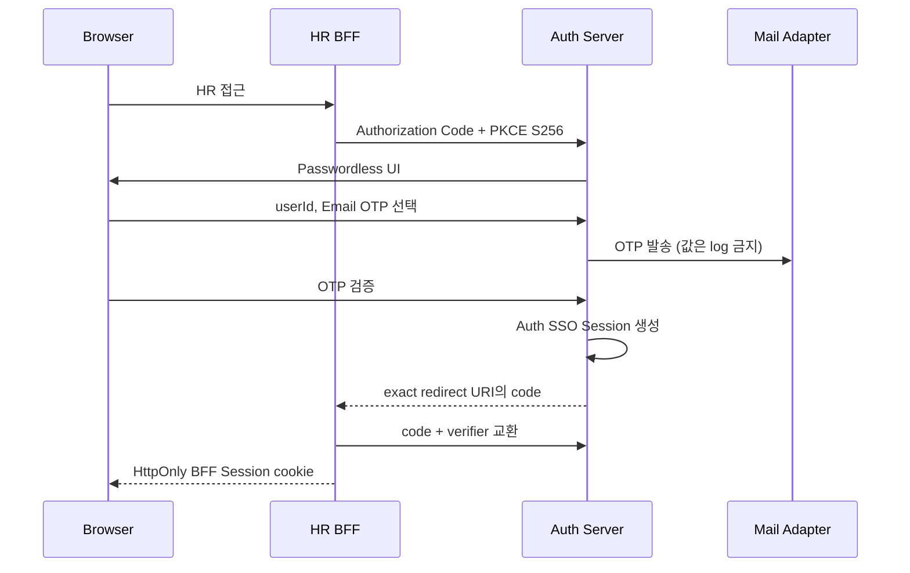
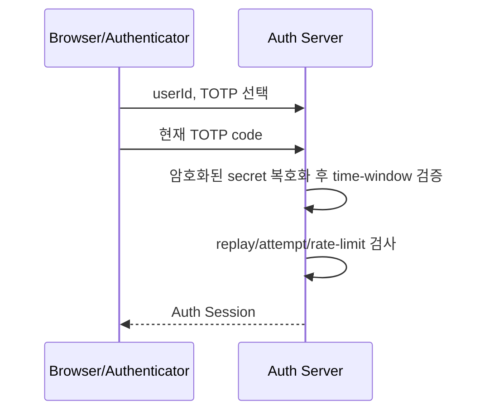
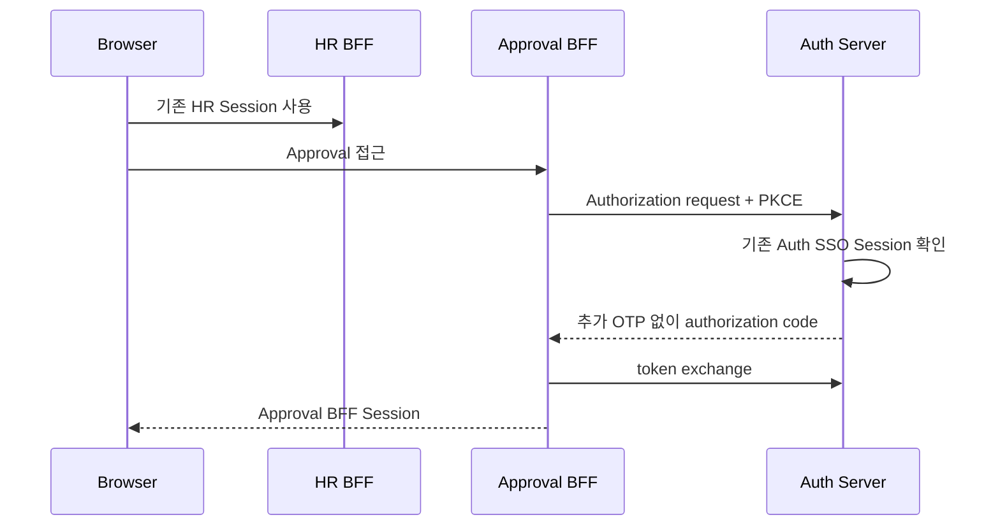
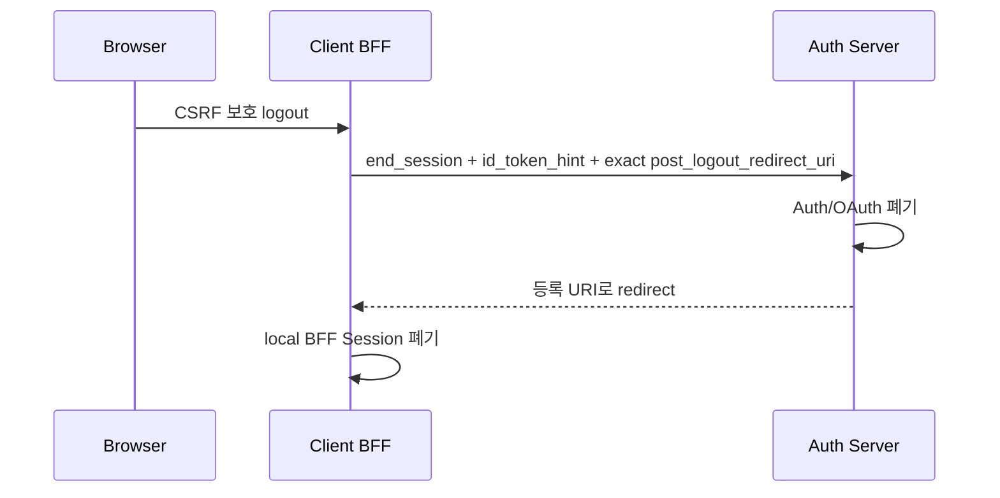
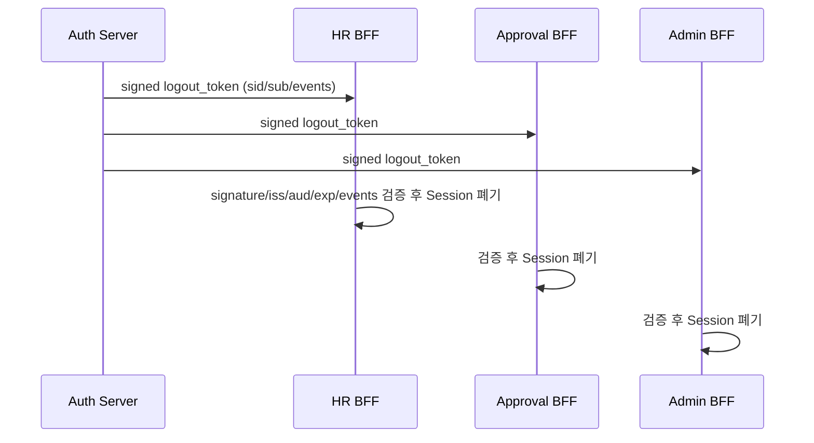
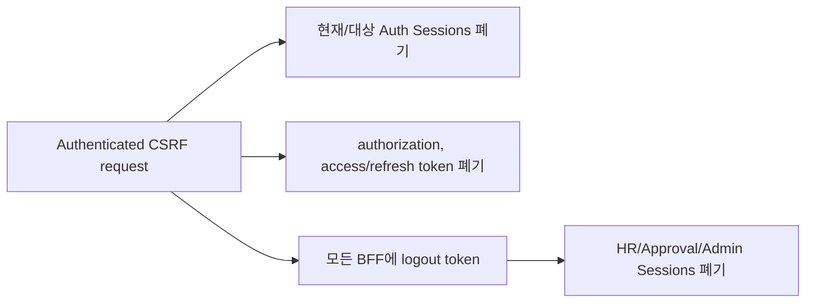
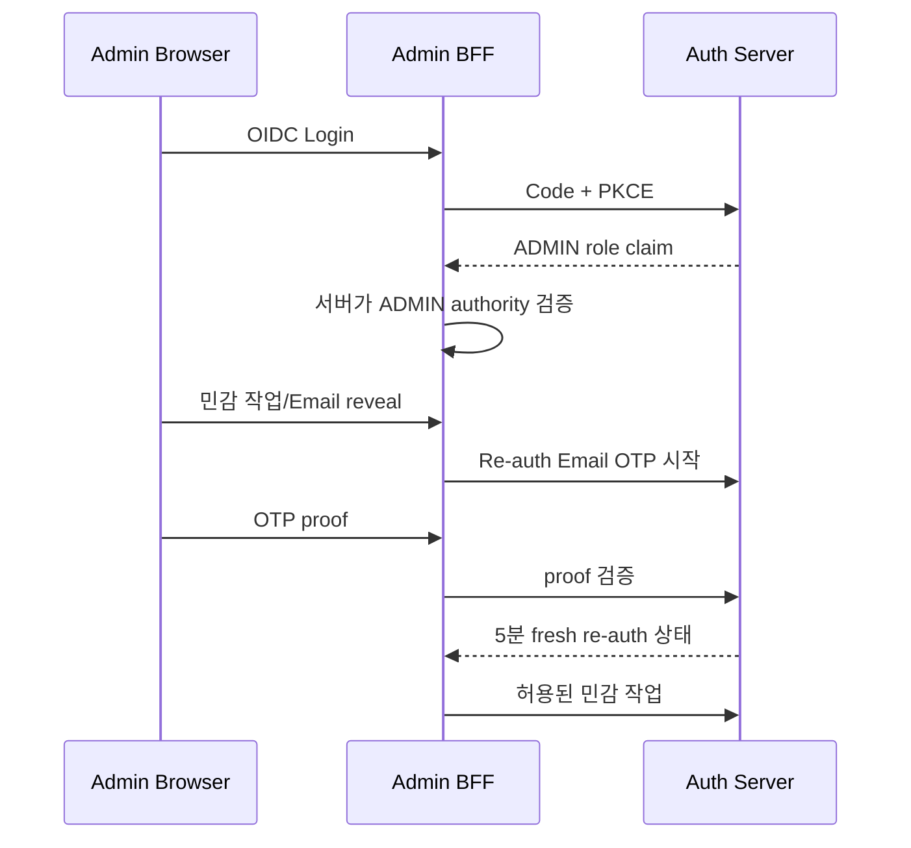

# SSO and Logout Flows

## HR 최초 로그인: Email OTP

Email OTP 응답은 계정 존재 여부를 노출하지 않는 공통 형태이며 만료, 재전송 간격, 시도 횟수, 재사용 방지를 적용합니다.

## TOTP 로그인

TOTP가 등록된 사용자만 선택할 수 있습니다. Recovery Code는 일반 로그인에 사용하지 않고 TOTP 복구 흐름에서 한 번만 소비합니다.

## HR에서 Approval로 SSO

새 ID Token의 `sub`, `preferred_username`, `roles`, `groups`, `amr`, `acr`은 Auth가 발급 시점에 계산합니다.

## RP-Initiated Logout

## Back-Channel Logout

Browser cookie 삭제에 의존하지 않습니다. 잘못된 token은 Session을 종료하지 않습니다. 전송은 bounded best-effort이며 durable outbox/retry는 v1 범위가 아닙니다.

## Global Logout

Global Logout 후 기존 Refresh Token으로 Session을 되살릴 수 없어야 합니다.

## Admin Login과 Email Re-auth

React가 전달한 role이나 UI 확인 문구는 authorization 근거가 아닙니다.
