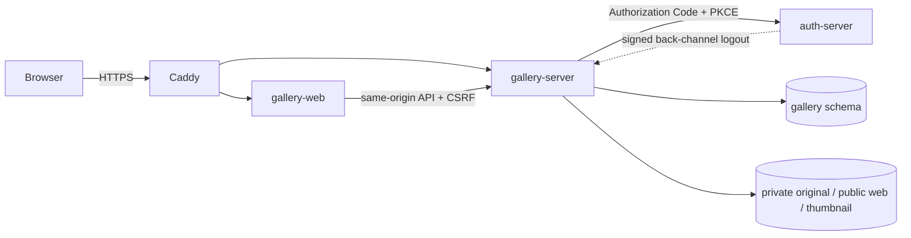

# Quiet Winter Gallery architecture

## 경계와 데이터 흐름

Gallery는 하나의 `gallery-web`과 `gallery-server`로 구성된다. 공개 Home, Works, About,
Scene Viewer와 문의 작성은 로그인 없이 사용할 수 있지만, `/studio/**`와 Studio API는 기존
Auth의 Gallery 전용 confidential OIDC client를 통해 로그인한 `ROLE_ADMIN`만 사용할 수
있다. Gallery는 Auth의 schema나 repository를 직접 읽지 않고 검증된 OIDC claim만 사용한다.

## Routes

Public routes:

- `/` — 최근 공개 작품 최대 4점의 Home 전시장
- `/works` — 검색, 필터, 정렬, 페이지 탐색
- `/about` — 전시 소개
- `/artworks/{publicId}?scene=1~3` — URL 기반 Scene Viewer

Studio routes:

- `/studio/artworks` — 작품 목록과 drag-and-drop 순서 변경
- `/studio/artworks/new` — 작품 생성
- `/studio/artworks/{id}` — 편집, 공개, 이미지와 대표 이미지 관리
- `/studio/inquiries` — 문의 목록과 상태 관리

## API

- `GET /api/v1/gallery/home`
- `GET /api/v1/gallery/artworks`
- `GET /api/v1/gallery/artworks/{publicId}`
- `POST /api/v1/gallery/inquiries`
- `GET|POST /api/v1/gallery/studio/artworks`
- `GET|PATCH|DELETE /api/v1/gallery/studio/artworks/{id}`
- `PATCH /api/v1/gallery/studio/artworks/order`
- `POST /api/v1/gallery/studio/artworks/{id}/images`
- `PATCH /api/v1/gallery/studio/artworks/{id}/images/primary`
- `DELETE /api/v1/gallery/studio/artworks/{id}/images/{imageId}`
- `GET|PATCH /api/v1/gallery/studio/inquiries[/{id}]`

공개 목록과 상세는 `published=true`만 조회한다. Studio는 내부 UUID를 사용하고 공개 route는
별도의 public UUID를 사용한다.

## Scene Viewer

Scene은 작품에 고정되지 않는다. URL의 `scene`이 source of truth이며 작품을 선택할 때마다
`1 → 2 → 3 → 1`로 이동한다. 같은 작품을 다시 선택해도 다음 Scene으로 이동하고 browser
history에 새 URL을 남긴다. Scene 정의는 `sceneDefinitions.ts`에 분리되어 있어 새 공간을
추가할 때 component의 조건문을 늘리지 않는다.

- Scene 1: 정면 벽, 대칭 조명과 중앙 작품
- Scene 2: 두 벽이 만나는 코너와 비대칭 원근
- Scene 3: 긴 측면 벽과 복도형 소실점

모두 semantic HTML/CSS 2D geometry로 구현하며 Three.js, WebGL, 자유 카메라는 사용하지
않는다. 작품의 실제 가로·세로 cm를 상대 크기에 반영하고 네 가지 frame type을 별도로
표현한다. 긴 설명은 desktop drawer, mobile bottom sheet로 제공한다.

## 이미지 저장

DB는 한 작품에 여러 `ArtworkImage`를 저장하고 대표 이미지를 한 장 선택한다. 원본은 공개
controller로 노출하지 않는다. 서버가 업로드를 decode한 뒤 web/thumbnail JPEG로 다시
인코딩하고 UUID storage key 아래에 저장한다. 공개 Home과 목록은 thumbnail, Scene은 web
variant를 사용한다.

업로드는 허용 MIME, 실제 decode 가능 여부, byte/pixel 한도와 경로 정규화를 검증한다.
SVG는 허용하지 않는다. Production named volume은 one-shot init container가 non-root
Gallery runtime UID/GID에 맞춰 준비하며, DB와 image volume은 함께 백업해야 한다.

## 보안과 개인정보

- Studio authorization은 UI가 아니라 Spring Security의 서버 측 `ROLE_ADMIN`으로 강제한다.
- Cookie 기반 API는 기존 CSRF 정책을 유지하고 공개 문의 POST도 CSRF token을 요구한다.
- 작품명과 설명은 raw HTML로 렌더링하지 않고 React text rendering을 사용한다.
- 문의의 이름, email, phone, message는 application log에 기록하지 않는다.
- 문의 UI는 개인정보 처리 동의를 명시적으로 요구하되 법적 준수 완료를 주장하지 않는다.
- Gallery OIDC client secret은 별도 Docker Secret이며 repository나 frontend bundle에 넣지 않는다.

